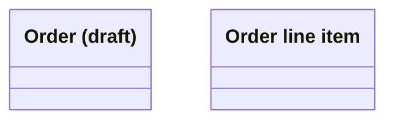
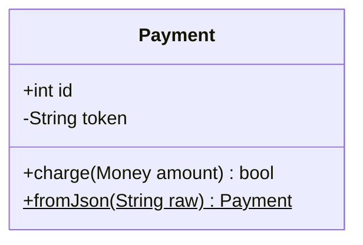
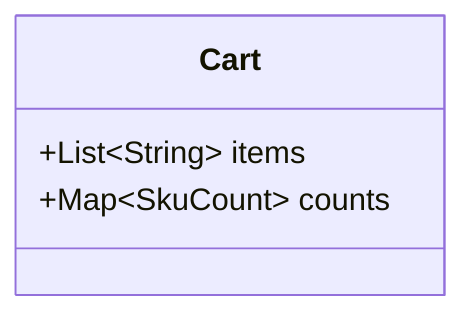
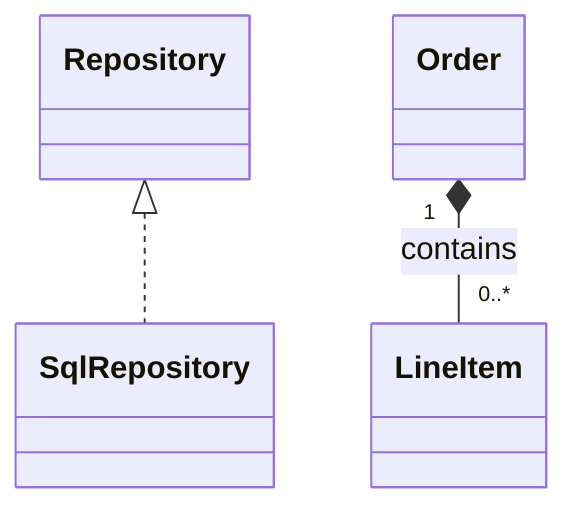
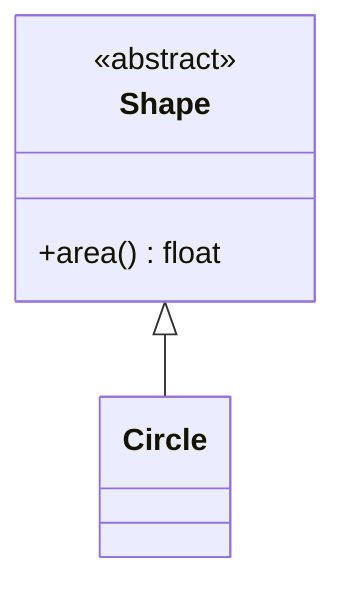
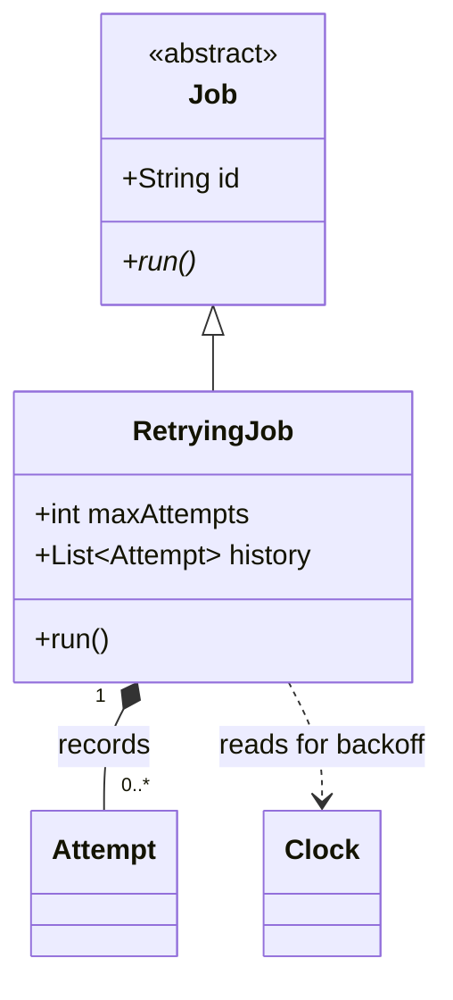

# Mermaid Class Diagrams

Class-specific conventions and traps, loaded by the `prepare-diagram` skill on top of
`./mermaid-core.md`. Quoting, ID discipline, direction, size, portability, and styling live in the
core sheet and are not repeated here. Snippets are render-verified against mermaid-cli **11.16.0**;
deliberately broken examples sit in plain fences.

Reach for a class diagram when the subject is code types and how they relate. When the subject is
persisted data, that is an ER diagram; when it is one object's lifecycle, a state diagram.

## Declaration and names

- Open with `classDiagram`. Class names take letters, digits, `_`, and `-` only; display text goes in
  a bracketed label, quoted per the core sheet.
- A space inside a class name is silently deleted rather than reported. `class Order Item` renders one
  box named `OrderItem`, and a later `Order --> Cart` quietly adds a second box named `Order`.

Broken — unquoted label, and a name split by a space:

```
classDiagram
    class ord[Order (draft)]
    class Order Item
```

Correct:



## Members

- Parentheses decide the kind: with `()` the member is a method, without it an attribute. So a
  parenthetical inside an attribute silently converts it — `+Money total (gross)` renders as the
  method `+Money total(gross)`. Fold the qualifier into the name (`+Money grossTotal`) instead.
- Use the `{ }` block for several members; `Class : +int id` adds one in passing. Do not mix forms.
- Visibility prefixes are `+` public, `-` private, `#` protected, `~` package. Suffix `*` for abstract
  and `$` for static. Give the return type after the closing paren: `+charge(Money amount) bool`.
- Show the members carrying the type's invariant; omit getters, setters, and framework boilerplate.



## Generics use tildes — angle brackets fail silently

`~T~` is the generic syntax. `<T>` also parses, but the parameter is swallowed as an HTML tag and
vanishes from the render, so the diagram quietly claims less than it meant to.

Broken — renders as `+List items`, parameter gone:

```
classDiagram
    Cart : +List<String> items
```

Correct:



- Nested parameters (`List~List~int~~`) work. Comma-separated ones (`Map~String, int~`) render under
  11.16.0 but upstream documents them as unsupported — prefer a named type, per the core sheet.

## Relationship arrows and how to read them

The high-confusion spot, and the one worth stating explicitly rather than guessing: **the decorated
end attaches to the parent** — the base class, the whole, the interface — and the plain end to the
child or part. Write the decorated end on the left and keep that orientation for the whole diagram.

- `Base <|-- Derived` inheritance: "Derived is a Base". `Interface <|.. Impl` realization: same
  arrowhead, dashed line, `Impl` implements the interface.
- `Whole *-- Part` composition: the part is owned exclusively and dies with the whole.
- `Whole o-- Part` aggregation: the whole references parts that outlive it.
- `A --> B` association: A holds a durable reference to B.
- `A ..> B` dependency: A uses B transiently — a parameter, a return type, a call.
- Composition versus aggregation is a claim about lifetime, not about how strong the coupling feels.
  If you cannot say whether the part survives the whole's deletion, use plain association and let the
  prose carry the nuance.
- Multiplicity goes in quotes on each side and counts the class on that side, label after the colon.



## Annotations

Declare `<<interface>>`, `<<abstract>>`, or `<<enumeration>>` inside the member block. The standalone
form is order-dependent: written before its class it crashes with `Cannot read properties of
undefined` rather than a parse error, which is a confusing failure to chase.

Broken — annotation ahead of the declaration:

```
classDiagram
    <<abstract>> Shape
    class Shape
```

Correct:



- `namespace pkg { }` groups classes; `note for Shape "text"` attaches prose. Use either only when the
  grouping or the caveat is itself part of the answer.

## Worked example

One small diagram applying the sheet — an abstract base, tilde generics, a composition carrying
multiplicity, and a dependency kept distinct from it.


