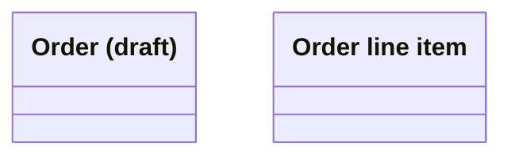
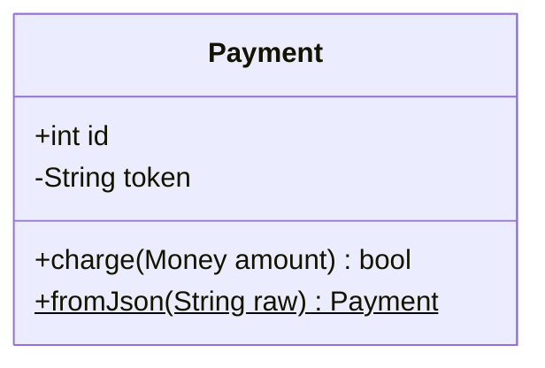
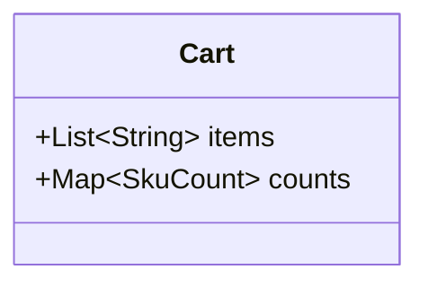
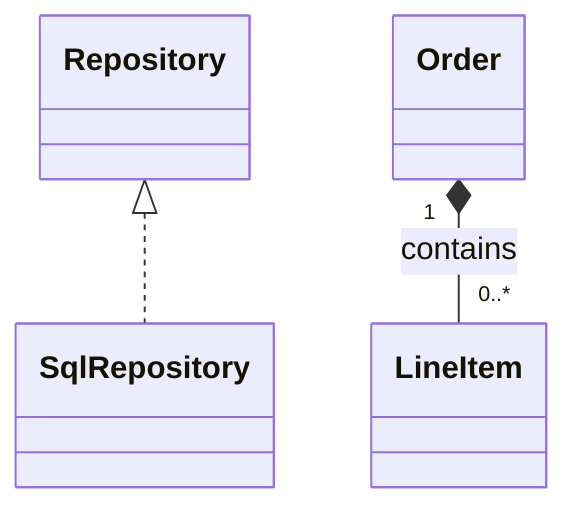
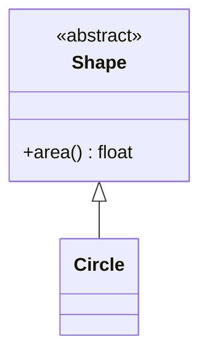
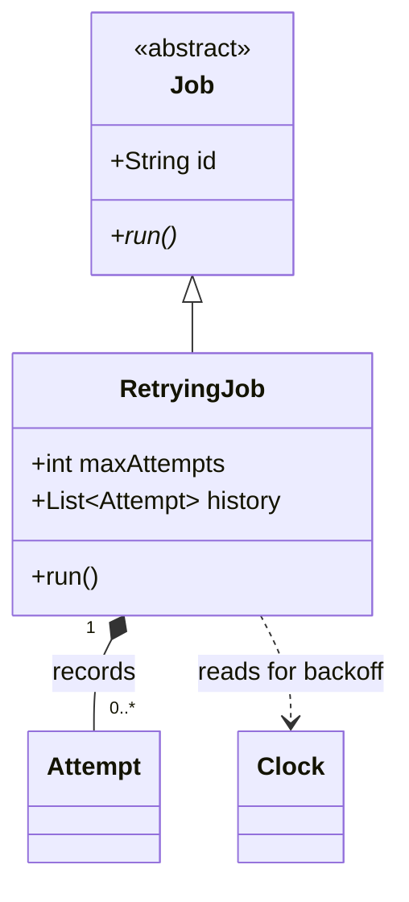

# Mermaid Class Diagrams

Use for code types and their relationships. Choose ER for persisted data or state diagrams for one object's lifecycle. Apply `./mermaid-core.md`.

## Declaration and names

- Open with `classDiagram`. IDs take letters, digits, `_`, and `-`; put display text in quoted bracketed labels.
- Avoid spaces in IDs: Mermaid silently removes them, and later partial references create extra classes.

Broken:

```
classDiagram
    class ord[Order (draft)]
    class Order Item
```

Correct:



## Members

- Parentheses mark methods; without them, members are attributes. Put attribute qualifiers in names, such as `grossTotal`, to avoid silent conversion.
- Use `{ }` for several members or `Class : +int id` for one. Do not mix forms.
- Visibility: `+` public, `-` private, `#` protected, `~` package. Suffix `*` marks abstract; `$` marks static.
- Put return types after closing parentheses: `+charge(Money amount) bool`.
- Show members carrying invariants; omit accessors and framework boilerplate.



## Generics use tildes — angle brackets fail silently

Use `~T~`. Angle-bracket parameters parse but vanish as HTML tags.

Broken:

```
classDiagram
    Cart : +List<String> items
```

Correct:



- Nested `List~List~int~~` works. Prefer named types over comma-separated generic parameters because upstream documents those as unsupported.

## Relationship arrows and how to read them

Attach decorated ends to the parent: base class, whole, or interface. Keep that end on the left consistently.

- `Base <|-- Derived`: inheritance; Derived is a Base.
- `Interface <|.. Impl`: realization; Impl implements Interface.
- `Whole *-- Part`: composition; exclusive ownership, with the part dying alongside the whole.
- `Whole o-- Part`: aggregation; referenced parts outlive the whole.
- `A --> B`: association; A holds a durable reference to B.
- `A ..> B`: dependency; transient use through a parameter, return type, or call.
- Choose composition/aggregation by lifetime. When lifetime is unknown, use association and explain the nuance in prose.
- Quote multiplicities at each end; each counts the adjacent class. Put relationship labels after the colon.



## Annotations

Put `<<interface>>`, `<<abstract>>`, or `<<enumeration>>` inside the member block. A standalone annotation before its class crashes.

Broken:

```
classDiagram
    <<abstract>> Shape
    class Shape
```

Correct:



- Use `namespace pkg { }` for meaningful groups and `note for Shape "text"` for needed caveats.

## Worked example


