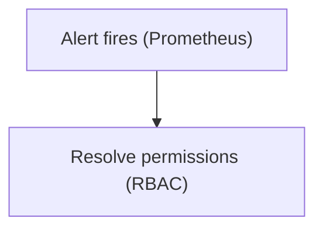
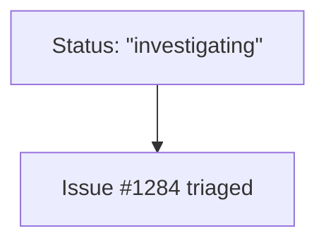
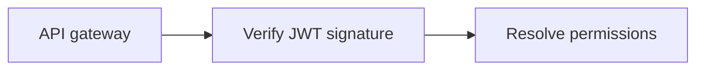
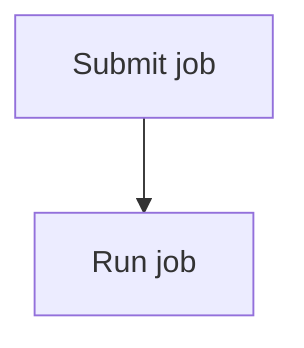

# Mermaid Core Conventions

Use with `./mermaid-flowchart.md` or the matching sequence, class, ER, or state sheet. Consult <https://mermaid.js.org/> for uncovered constructs. Existing Mermaid snippets were render-verified with mermaid-cli **11.16.0**; broken examples use plain fences.

## Conservative syntax

- Default to long-stable syntax because target versions are usually unknown. Use newer features only for a named target known to support them.
- Avoid generalized `A@{ shape: rect }` shapes, icons/images, edge IDs/animation, and backtick markdown-string labels on unknown renderers.
- Prefer no configuration. When needed, use frontmatter `config:` instead of deprecated `%%{init: ...}%%` directives.

## Labels and special characters

- Double-quote labels containing anything beyond letters, digits, spaces, and hyphens. Unquoted parentheses or brackets can close shapes prematurely.

Broken:

```
flowchart TD
    a[Alert fires (Prometheus)] --> b[array[0] lookup]
```

Correct:



- Escape literal double quotes as `#quot;`. Base-10 entities also work, such as `#35;` for `#`.



- Use `<br/>` for line breaks; avoid other HTML because renderer support varies.
- Quoting every label is acceptable, including characters a renderer permits bare.

## IDs versus display labels

- Give nodes and participants short, stable role IDs and quoted display labels.
- Declare each label at first mention; later references use its ID.
- Use distinct IDs for every element, including containers and their children.



## Direction

- Default to `TD` for processes, decisions, and hierarchies because readers scan downward.
- Prefer `LR` for pipelines, system-boundary crossings, or long labels.
- `TD` and `TB` are equivalent. Choose one and keep direction consistent across a document's diagrams.

## Size discipline

- Aim near 15 nodes and 20 edges.
- Split by the question answered, preserving meaningful labels and steps.
- If a diagram needs a legend, consider splitting it or explaining the detail in prose.

## Comments and styling

- Use `%%` comments for non-obvious scope or omissions, without narrating nodes.



- Default to no styling because renderer themes adapt to light/dark mode. Omit `style`, `classDef`, `class`, `linkStyle`, and theme configuration.
- Add styling only when requested or when color communicates meaning structure cannot. State that reason.

## Before returning a diagram

- Run `npx -y @mermaid-js/mermaid-cli -i d.mmd -o d.svg`. Passing requires exit 0 and an SVG on disk; parse failure exits 1 without output.
- Deliver an unrendered diagram only when tooling is unavailable, stating the skipped validation and reason.
- Read labels for the audience: expand first-use acronyms and remove unfamiliar internal shorthand.
