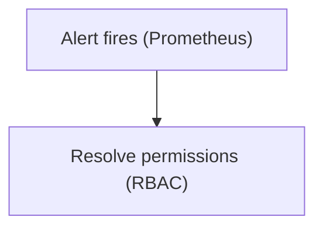
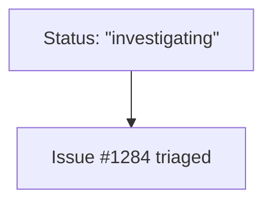
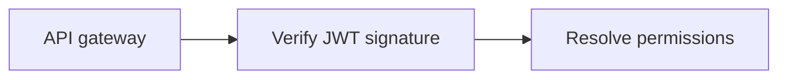
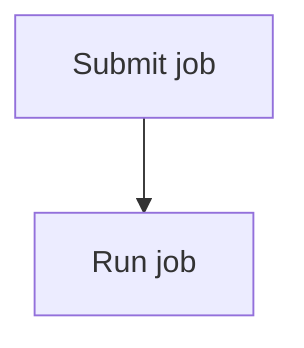

# Mermaid Core Conventions

Cross-type conventions for generating Mermaid — what holds regardless of which diagram is being
drawn. Loaded by the `prepare-diagram` skill together with the one per-type sheet for the diagram at
hand (`./mermaid-flowchart.md` and the sequence, class, ER, and state sheets beside it). This file
owns portability, label and ID discipline, direction, size, and comments; per-type syntax and its
traps live in the type sheet and are not restated here.

These are pitfall and style checklists, not a syntax reference — consult
<https://mermaid.js.org/> for a construct no sheet covers. Every ` ```mermaid ` snippet in these
sheets is render-verified against mermaid-cli **11.16.0**; deliberately broken examples sit in plain
fences so they are never mistaken for working syntax.

## Conservative syntax

Real render targets pin their own Mermaid versions — GitHub markdown, Notion, and Claude artifacts
each ship a different one, and all of them lag the docs site. A diagram that renders on the newest
release and fails on a pinned one is simply a broken diagram.

- Default to long-stable syntax — constructs that have been in Mermaid for years — because the
  target renderer's version is usually unknown. Deviate only when the user names a target you know
  carries the feature.
- Never reach for a construct *because* it is new. Recency is not a reason.
- Avoid on portability grounds: the v11.3+ `A@{ shape: rect }` generalized-shape form and the ~30
  shapes only reachable through it; icon and image shapes; edge IDs and edge animation; backtick
  markdown-string labels. These parse under 11.16.0 and fail on renderers a year older.
- `%%{init: ...}%%` directives are deprecated as of v10.5.0 in favor of a frontmatter `config:`
  block. Prefer frontmatter if configuration is genuinely needed — and prefer emitting none at all.

## Labels and special characters

An unquoted special character in a label is the highest-frequency generation failure by a wide
margin. Quoting costs nothing and removes the entire class.

- Wrap a label in double quotes whenever it contains anything beyond letters, digits, spaces, and
  hyphens. Parentheses and square brackets are the ones that actually bite — they close the node
  shape early and the parse dies on a cryptic `got 'PS'`.

Broken — unquoted parentheses and brackets:

```
flowchart TD
    a[Alert fires (Prometheus)] --> b[array[0] lookup]
```

Correct:



- A literal `"` inside a quoted label also kills the parse. Use the entity `#quot;`. Any character
  works as a base-10 entity, so `#35;` renders `#`.



- `<br/>` is the one HTML tag worth using — the portable line break. Otherwise keep HTML out of
  labels: renderers vary in what they support and many sanitize it away entirely.
- `&`, `:`, `,`, `/`, `#`, and `<` all parse bare under 11.16.0, so quoting them is optional —
  but quoting unconditionally is harmless and leaves one less rule to remember.

## IDs versus display labels

IDs are code; labels are prose. Keeping the two separate is what makes a diagram editable later.

- Give every node or participant a short, stable ID naming its role (`gw`, `verify`, `deployProd`),
  and put the human text in a quoted label. The ID is how later edges refer back to it.
- Declare a label once, at the element's first mention; every later mention uses the bare ID. The
  same label written twice is two strings to keep in sync.
- Never reuse one ID for two elements, and never give a node the same ID as its container (subgraph,
  class, participant). Mermaid reports this as a cycle rather than a syntax error — a confusing
  failure to debug.



## Direction

- Default `TD` (top-down) for anything reading as a process, decision tree, or hierarchy, because
  readers scan top-to-bottom and branches fan out naturally.
- Prefer `LR` for pipelines, a request crossing system boundaries, or when labels are long — wide
  labels in a `TD` graph produce a very tall, thin image that reads badly at page width.
- `TD` and `TB` are identical; pick one and stay with it.
- Keep direction consistent across the diagrams in a single document — cross-document consistency
  beats each diagram's local optimum.

## Size discipline

- Keep a diagram near 15 nodes and 20 edges. Past roughly that, comprehension falls faster than the
  added information repays.
- Split by the question the diagram answers, not by node count alone. One diagram answering both
  "how does a request flow?" and "how do we deploy?" is two diagrams.
- Prefer splitting over shrinking. Dropping labels or collapsing steps to hit a size budget usually
  deletes the part the reader actually needed.
- A diagram needing a legend to be read is usually two diagrams, or one diagram plus prose.

## Comments and styling

- `%%` opens a line comment. Use one to record a non-obvious scope or omission, not to restate what
  the nodes already say.



- Emit no styling by default — no `style`, `classDef`, `class`, `linkStyle`, no theme config.
  Default themes adapt to the target's light and dark rendering, while hand-picked colors usually
  become unreadable in one of the two. Add styling only when asked, or when color carries meaning
  the structure cannot — and then say so.

## Before returning a diagram

- Render-check it: `npx -y @mermaid-js/mermaid-cli -i d.mmd -o d.svg`. Exit 0 plus an SVG on disk is
  the pass; a parse error exits 1 and writes no file. Never hand over an unrendered diagram — with
  one carve-out: when the tooling is unavailable (no `npx`, or no network for the package fetch),
  deliver the diagram anyway and state that render validation was skipped and why. A skipped check
  is stated, never silent.
- Reread every label as an outside reader: expand acronyms on first use and cut internal shorthand
  that the audience does not share.
