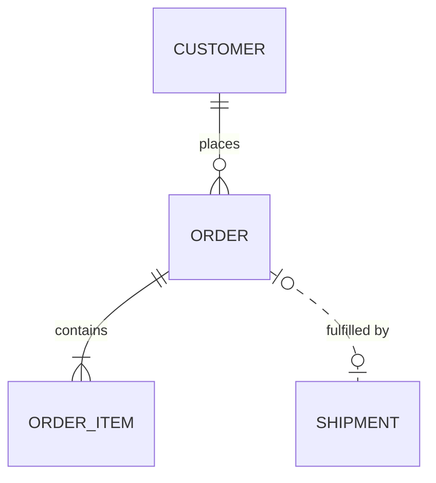
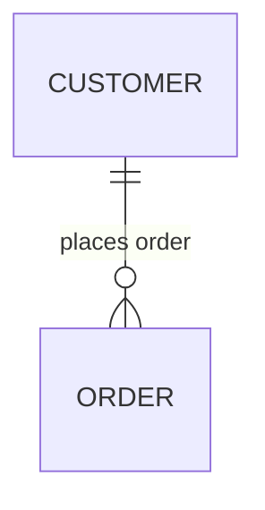

# Mermaid Entity Relationship Diagrams

ER-specific conventions and traps, loaded by the `prepare-diagram` skill on top of
`./mermaid-core.md`. Quoting, ID discipline, direction, size, portability, and styling live in the
core sheet and are not repeated here. Snippets are render-verified against mermaid-cli **11.16.0**;
deliberately broken examples sit in plain fences.

Reach for an ER diagram when the subject is persisted data — what is stored, and how many of each
record relates to how many of another. When the subject is code types rather than storage, that is a
class diagram.

## Entities and attributes

- Open with `erDiagram`. Name entities after the things they store, in one token; `UPPER_SNAKE` is the
  prevailing convention because entity names usually track table names.
- A space in an unquoted entity name is not an error — it silently produces **two** entities.
  `ORDER ITEM { ... }` renders a bare `ORDER` box plus an `ITEM` box holding the attributes. Use one
  token, and add a bracketed alias when the display name needs spaces.
- Attributes are `type name [keys] ["comment"]`, and the type is mandatory — a bare `id` on its own
  line is a parse error.
- Types may carry parentheses and brackets bare: `varchar(255)`, `decimal[10,2]`. The core sheet's
  quoting rule is about labels, and these are not labels.
- Keys are `PK`, `FK`, `UK`, comma-separated for a composite key. The legacy `*id` marker renders as
  literal text with no key column, so it silently understates the schema — always use `PK`.
- Comments must be quoted and cannot contain a literal `"`; use the `#quot;` entity from the core
  sheet. Avoid the `string?` nullable-type mark, which is new in 11.16.0.

Broken — entity name split by a space, attribute with no type:

```
erDiagram
    ORDER ITEM {
        id
    }
```

Correct:

```mermaid
erDiagram
    ORDER_ITEM["Order line item"] {
        int order_id PK, FK
        int line_no PK
        varchar(255) sku
        decimal[10,2] unit_price "excludes tax"
    }
```

## Cardinality: what each half actually claims

This is where a generated ER diagram most often lies, because both halves read plausibly either way.
The rule: **each marker counts the entity it sits next to**, for one instance of the entity at the
other end. So `CUSTOMER ||--o{ ORDER : places` is two statements — one CUSTOMER per ORDER (`||`,
touching CUSTOMER) and zero or more ORDERs per CUSTOMER (`o{`, touching ORDER). Read both sentences
out loud before returning the diagram; a wrong marker renders perfectly.

- Each marker is two characters: outer is the maximum, inner the minimum.
  - `||` on either side — exactly one.
  - `|o` left, `o|` right — zero or one.
  - `}|` left, `|{` right — one or more.
  - `}o` left, `o{` right — zero or more.
- The crow's foot (`}` or `{`) is the "many" fork and always faces the line, so it is written first on
  the left side and last on the right side.
- `--` is identifying: the child cannot exist without the parent and its key includes the parent's.
  `..` is non-identifying: the child has its own identity and the reference may be optional. Default
  to `..` when the foreign key is nullable.
- The word aliases (`CUSTOMER only one to zero or more ORDER : places`) render identical markers.
  Default to the symbol form, since that is what most examples and reviewers expect; the words are
  worth their width when a reader has to audit the claim.



## Relationship labels are mandatory, and quoting them is not optional

- A relationship with no label is a parse error. Every one needs `: something`, or `: ""` to render
  none.
- An unquoted multi-word label keeps the first word and turns the rest into **phantom entities**:
  `: places order` renders a stray third box named `order`, wired to nothing. The diagram renders
  clean, so only a reread catches it. Quote every label containing a space.
- Phrase the label as a verb reading parent to child, so the diagram reads as a sentence —
  "CUSTOMER places ORDER".

Broken — the second word becomes an entity:

```
erDiagram
    CUSTOMER ||--o{ ORDER : places order
```

Correct:



## Scope

- Show the attributes that carry keys plus the few the reader's question turns on. A full column list
  makes the diagram a schema dump, which the DDL already does better and keeps in sync for free.
- Split by subject area rather than shrinking type sizes, per the core sheet — an ER diagram covering
  billing and content is two diagrams.

## Worked example

One small model applying the sheet — quoted comments, composite key, an identifying relationship
beside a non-identifying one, and both cardinality halves stated deliberately.

```mermaid
erDiagram
    CUSTOMER {
        int id PK
        varchar(255) email UK "login identity"
    }
    ORDER {
        int id PK
        int customer_id FK
        varchar(32) status "open, paid, or cancelled"
    }
    ORDER_ITEM {
        int order_id PK, FK
        int line_no PK
        decimal[10,2] unit_price
    }
    SHIPMENT {
        int id PK
        int order_id FK
    }
    CUSTOMER ||--o{ ORDER : places
    ORDER ||--|{ ORDER_ITEM : contains
    ORDER ||..o{ SHIPMENT : "shipped as"
```
