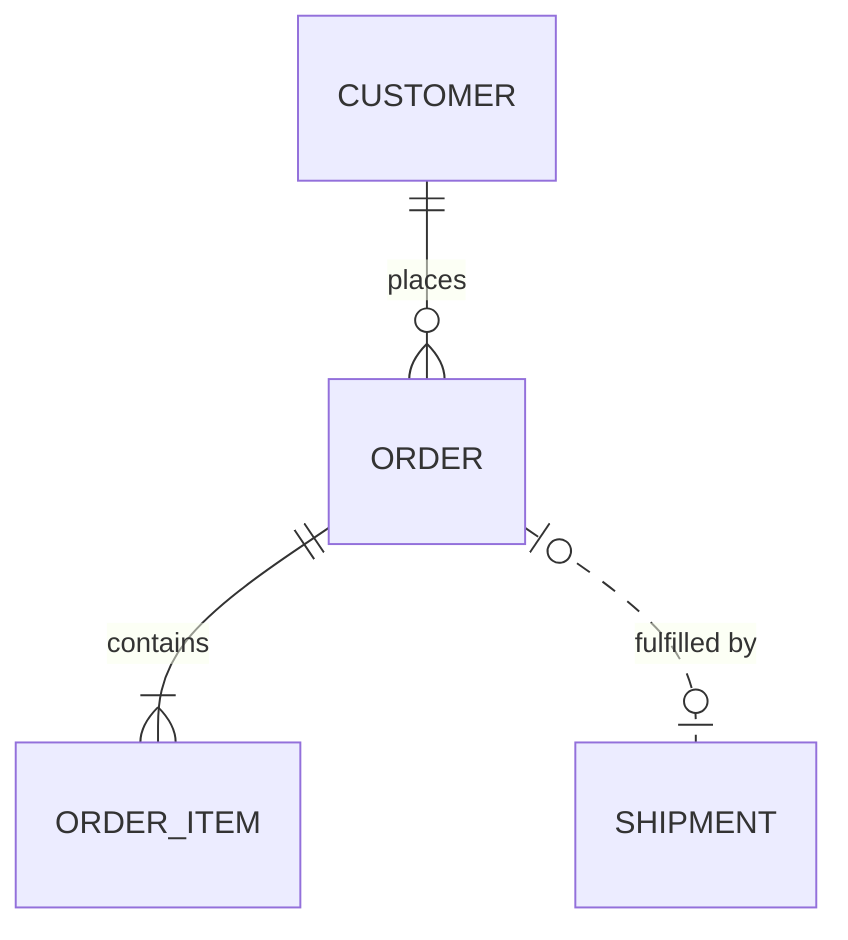
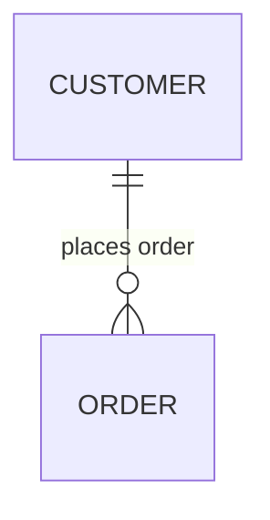

# Mermaid Entity Relationship Diagrams

Use for persisted data and record cardinality. Choose class diagrams for code types. Apply `./mermaid-core.md`.

## Entities and attributes

- Open with `erDiagram`. Use single-token entity names, typically `UPPER_SNAKE` because names often track tables.
- Add quoted bracketed aliases for spaced display names. Unquoted spaces silently create separate entities.
- Attributes require `type name [keys] ["comment"]`; a bare name fails parsing.
- Types accept bare parentheses/brackets, such as `varchar(255)` and `decimal[10,2]`; label quoting does not apply.
- Mark keys with `PK`, `FK`, or `UK`, comma-separated when combined. Legacy `*id` renders literal text without key metadata.
- Quote comments and escape internal quotes as `#quot;`. Avoid the newer `string?` nullable-type syntax for portability.

Broken:

```
erDiagram
    ORDER ITEM {
        id
    }
```

Correct:

```mermaid
erDiagram
    ORDER_ITEM["Order line item"] {
        int order_id PK, FK
        int line_no PK
        varchar(255) sku
        decimal[10,2] unit_price "excludes tax"
    }
```

## Cardinality: what each half actually claims

Each marker counts its adjacent entity for one instance at the opposite end. Read both halves explicitly: `CUSTOMER ||--o{ ORDER` means one customer per order and zero-or-more orders per customer.

- `||` on either side: exactly one.
- `|o` left, `o|` right: zero or one.
- `}|` left, `|{` right: one or more.
- `}o` left, `o{` right: zero or more.
- Each marker has outer maximum and inner minimum. Write the many fork first on the left, last on the right.
- `--` identifies a child dependent on the parent, including the parent's key. `..` is non-identifying, with independent child identity.
- Default to `..` for nullable foreign keys because their reference is optional.
- Prefer symbols because reviewers expect them; word aliases such as `only one to zero or more` can help readers audit cardinality.



## Relationship labels are mandatory, and quoting them is not optional

- Supply every relationship's `: label`, or `: ""` for no visible text.
- Quote labels containing spaces; extra unquoted words silently become phantom entities.
- Use verbs reading parent to child, such as "CUSTOMER places ORDER".

Broken:

```
erDiagram
    CUSTOMER ||--o{ ORDER : places order
```

Correct:



## Scope

- Show key attributes and the few others the question needs.
- Split by subject area, preserving readable type sizes.

## Worked example

```mermaid
erDiagram
    CUSTOMER {
        int id PK
        varchar(255) email UK "login identity"
    }
    ORDER {
        int id PK
        int customer_id FK
        varchar(32) status "open, paid, or cancelled"
    }
    ORDER_ITEM {
        int order_id PK, FK
        int line_no PK
        decimal[10,2] unit_price
    }
    SHIPMENT {
        int id PK
        int order_id FK
    }
    CUSTOMER ||--o{ ORDER : places
    ORDER ||--|{ ORDER_ITEM : contains
    ORDER ||..o{ SHIPMENT : "shipped as"
```
