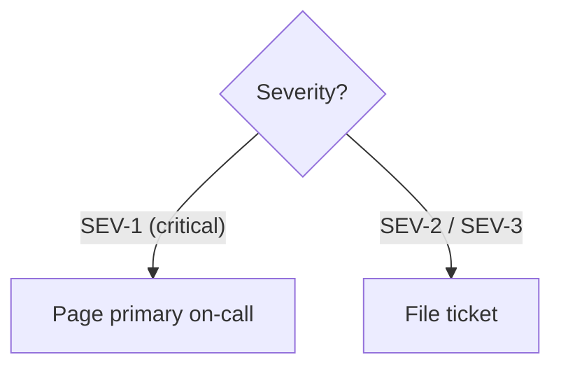
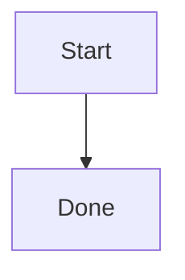
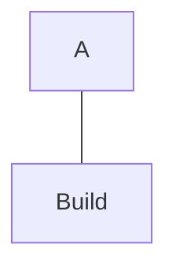
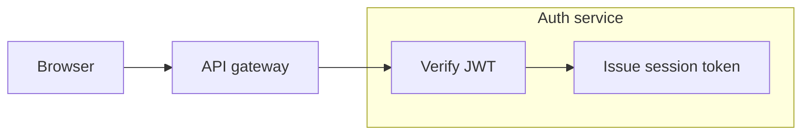

# Mermaid Flowcharts

Use for processes, decisions, and dependency structure. Use sequences for ordered participant interactions. Apply `./mermaid-core.md`.

## Declaration

- Default to `flowchart <direction>`; `graph <direction>` remains older syntax.

## Node shapes carry meaning

Keep each shape's meaning consistent.

- `["text"]` rectangle: step or action; use for most nodes.
- `{"text"}` rhombus: decision; label outgoing answers under § *Links and edge labels*.
- `(["text"])` stadium: process entry or exit.
- `[("text")]` cylinder: datastore.
- `[["text"]]` subroutine: detail supplied elsewhere.
- `(("text"))` circle: junction or connector; use sparingly.
- Default to these shapes because others lack shared meanings. Use alternatives when the audience has an established convention.


## Links and edge labels

- Use `-->` for normal flow, `-.->` for conditional/asynchronous/out-of-band flow, `==>` for one primary path, and `---` for undirected association.
- Choose one label form per diagram: `-- text -->` or `-->|text|`.
- Quote edge labels carrying special characters in either form.



- Label every decision edge with parallel answers, such as `yes`/`no`.
- `--o` and `--x` produce circle/cross endings. Use sparingly; check the ID collision below.

## Two traps that break or silently corrupt the graph

Avoid lowercase `end` as a node ID; it breaks parsing and can consume a subgraph's closing keyword. Choose another ID or capitalize it.

```
flowchart TD
    a["Start"] --> end["Done"]
```



Separate `---` from IDs beginning with `o` or `x`, or capitalize them. Otherwise the initial character becomes an edge ending, silently changing the target.

```
flowchart TD
    a["A"]---oBuild["Build"]
```



## Subgraphs

- Declare `subgraph id["Title"] ... end` with an explicit ID and quoted title.
- Close every group with `end`. First declare each node inside its single intended group; reuse does not move an external declaration inside.
- Connect inner nodes for flow. Edges between subgraph IDs claim relationships between the groups themselves.
- Treat internal `direction TB` as a hint; external edges may cause renderers to ignore it.
- Apply the core sheet's distinct-ID rule to subgraphs and nodes.
- Limit nesting to one level; split deeper structures.



## Worked example


