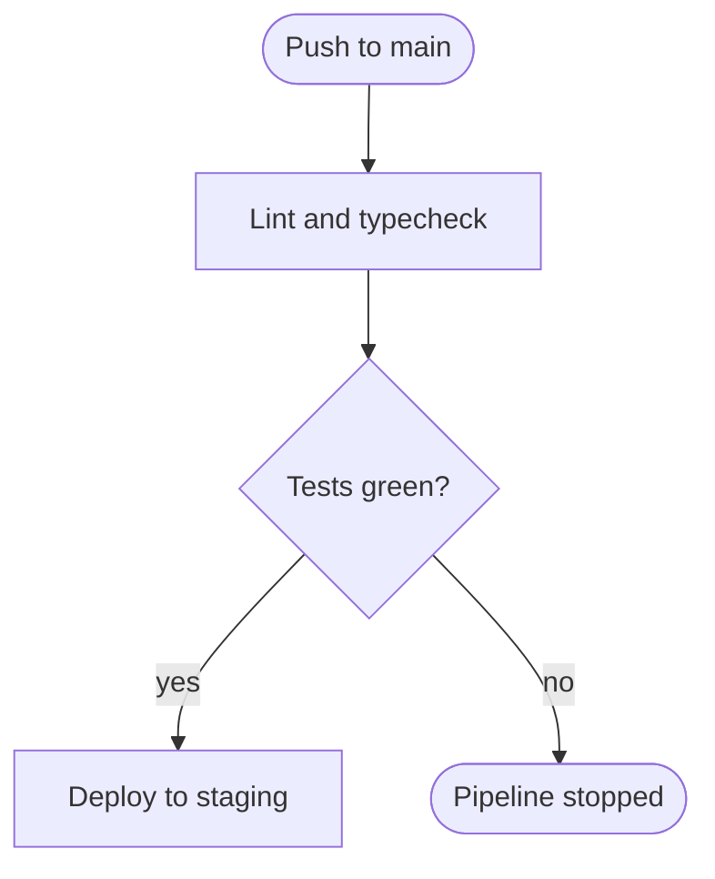
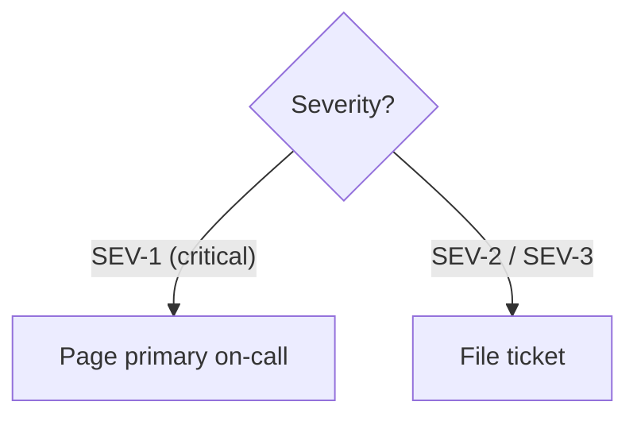
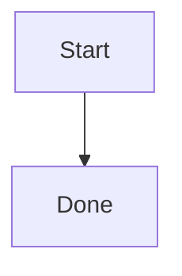
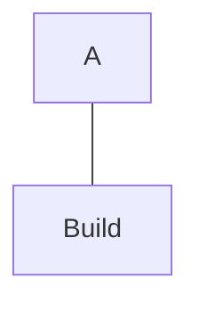
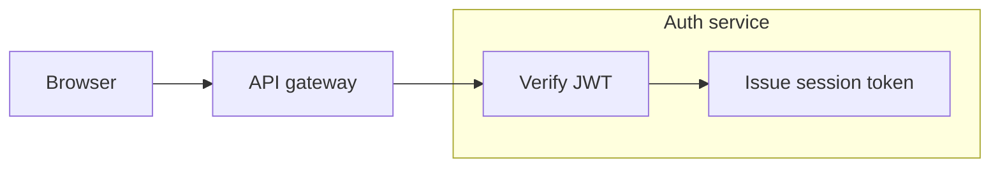
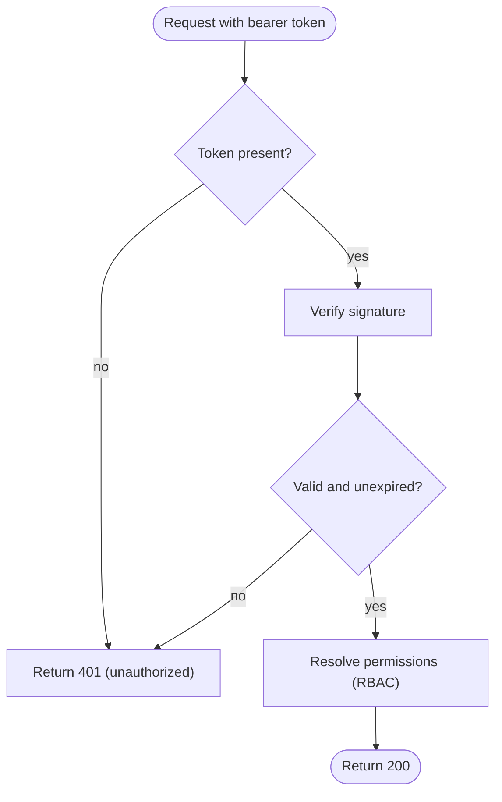

# Mermaid Flowcharts

Flowchart-specific conventions and traps, loaded by the `prepare-diagram` skill on top of
`./mermaid-core.md`. Quoting, ID discipline, direction choice, size, and portability live in the core
sheet and are not repeated here. Snippets are render-verified against mermaid-cli **11.16.0**;
deliberately broken examples sit in plain fences.

Reach for a flowchart when the subject is process, decision, or dependency structure. When the real
subject is ordered interaction between participants over time, that is a sequence diagram.

## Declaration

- Open with `flowchart <direction>`. The older `graph <direction>` keyword still parses, but
  `flowchart` is the current one and selects the newer layout engine — default to it.

## Node shapes carry meaning

Choose a shape for its semantics, then hold that mapping for the whole diagram. A shape used two
ways is worse than no shapes at all.

- `["text"]` rectangle — a step or action. The default; most nodes should be rectangles.
- `{"text"}` rhombus — a decision. Every edge leaving one must be labelled with its answer.
- `(["text"])` stadium — a terminal: the process entry or exit.
- `[("text")]` cylinder — a datastore.
- `[["text"]]` subroutine — a step whose detail lives elsewhere, often in another diagram.
- `(("text"))` circle — a junction or connector; use sparingly.
- Stop at that set by default. Hexagon `{{ }}`, parallelogram `[/ /]`, trapezoid `[/ \]`, and
  asymmetric `> ]` all render, but carry no widely-shared meaning, so each costs the reader a guess.
  Deviate when the audience has an established convention for them.



## Links and edge labels

- `-->` solid arrow for normal flow, and it should be nearly all of them. `-.->` dotted for
  conditional, asynchronous, or out-of-band flow. `==>` thick to mark one primary path. `---` open
  line for an undirected association.
- Both label forms work — `-- text -->` (centered) and `-->|text|` (beside the line). Pick one form
  per diagram.
- Quote any edge label carrying special characters. Parentheses survive unquoted in the `-- text -->`
  form but break the `|text|` form, so quote in both rather than tracking the difference.



- Label every edge leaving a decision node, and keep the answers parallel — `yes`/`no`, not
  `yes`/`failed`.
- `--o` and `--x` are circle and cross endings rather than arrowheads. They are also the source of
  the second trap below, and rarely worth using.

## Two traps that break or silently corrupt the graph

Both are documented upstream and both reproduce under 11.16.0.

A node ID of lowercase `end` breaks the flowchart outright. Capitalize it (`End`, `END`) or choose
another ID. Inside a subgraph it is worse: it also consumes the subgraph's own closing `end`.

```
flowchart TD
    a["Start"] --> end["Done"]
```



A node ID whose first letter is `o` or `x`, written tight against a preceding `---`, is lexed as an
edge ending instead of a node. `a[A]---oB[B]` produces a circle edge to node `B`; node `oB` is never
created. This parses and renders, so nothing warns you — the graph is just wrong. Add a space before
the ID, or capitalize it.

```
flowchart TD
    a["A"]---oBuild["Build"]
```



## Subgraphs

- Use `subgraph id["Title"] ... end`, with an explicit ID and a quoted title. The bare
  `subgraph Title` form parses, but leaves no handle for referring to the group.
- Close every subgraph with `end`, and declare each node inside exactly one group. A node first
  mentioned outside and reused inside stays in the outer graph.
- To show flow, connect the nodes inside the groups. An edge written between two subgraph IDs is a
  claim about the groups themselves and renders between cluster boxes, which is usually not what was
  meant.
- `direction TB` inside a subgraph sets that group's internal axis. It is honored under 11.16.0 even
  when the group's nodes link outside, but the upstream docs warn it may be ignored in exactly that
  case — so treat it as a hint and keep the diagram readable if it is dropped.
- Never give a subgraph the same ID as a node; per the core sheet, that surfaces as a cycle error.
- Nest at most one level deep. Deeper nesting loses more to cramped layout than it gains.



## Worked example

One small diagram applying the whole sheet — stadium terminals, rectangle steps, labelled decisions,
quoted special characters, and a shared failure node reached from two branches.


