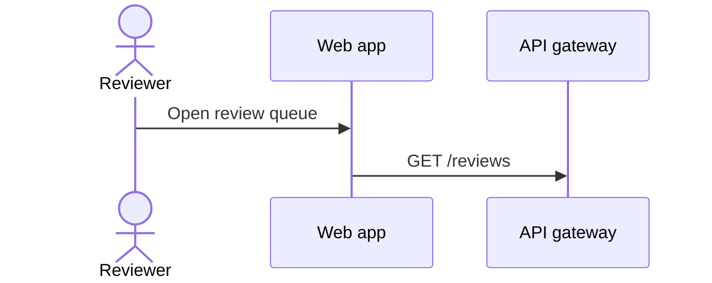
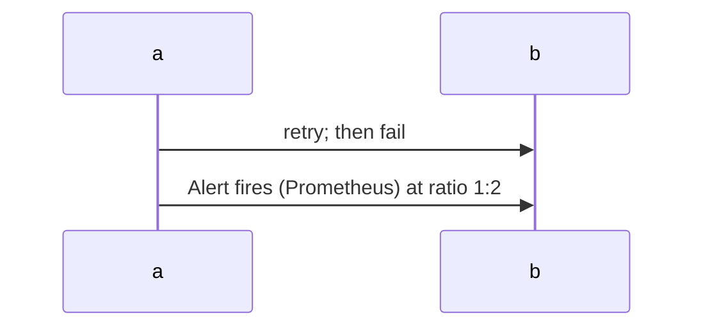
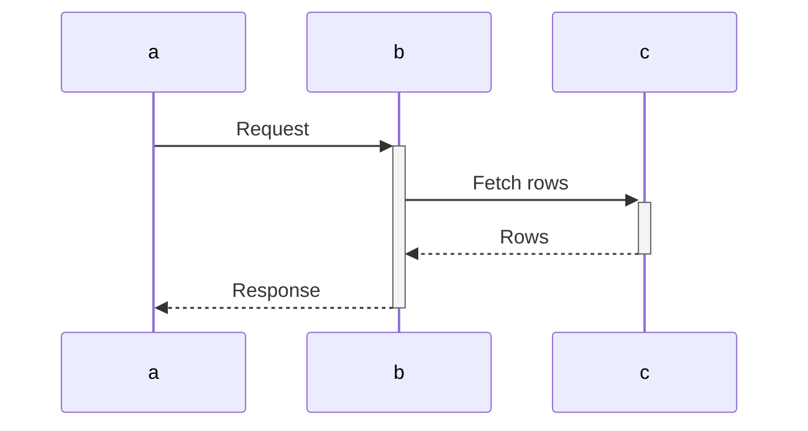
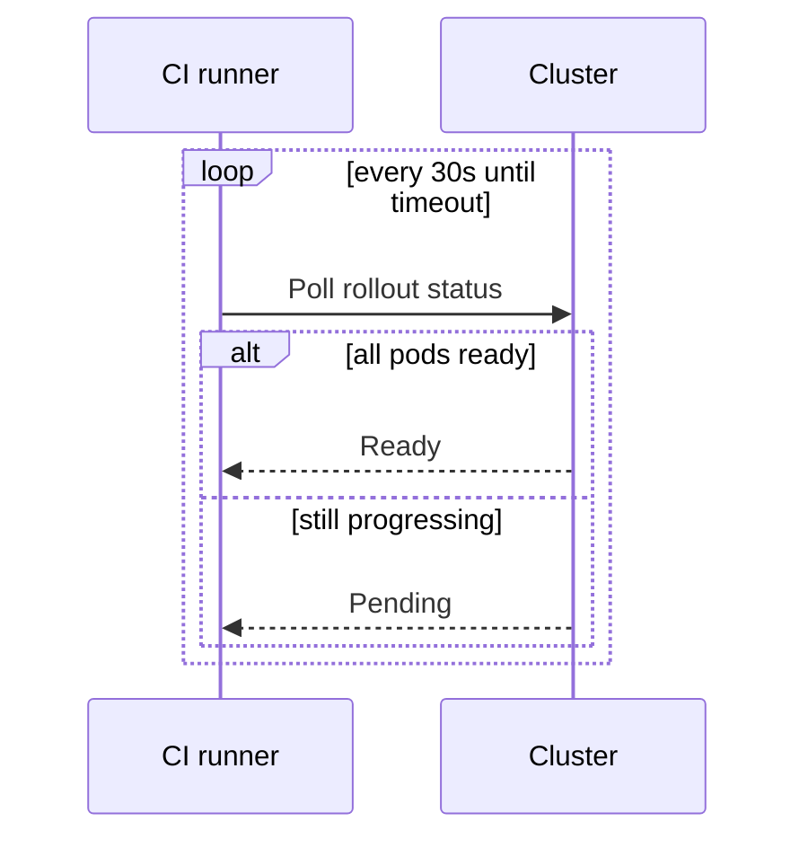
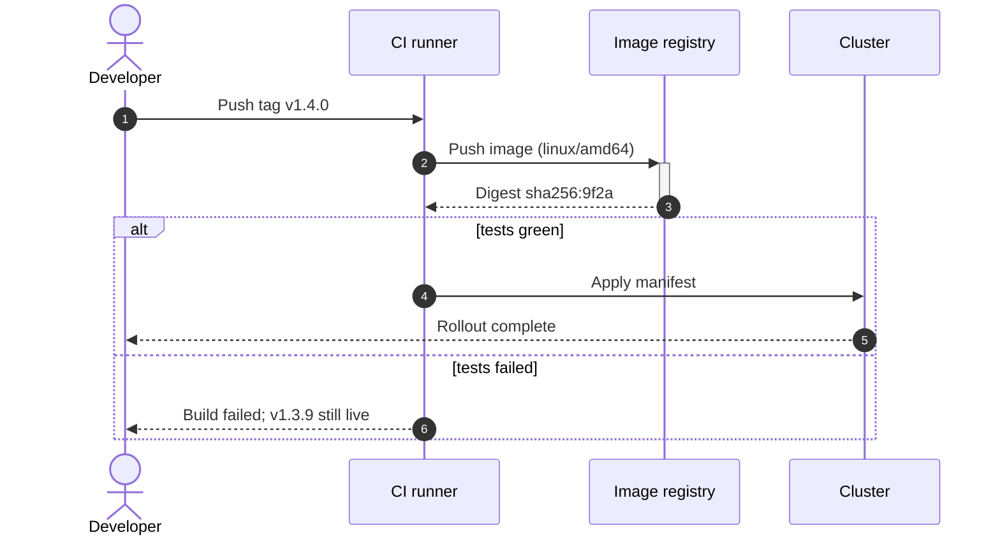

# Mermaid Sequence Diagrams

Sequence-specific conventions and traps, loaded by the `prepare-diagram` skill on top of
`./mermaid-core.md`. ID discipline, size, portability, comments, and styling live in the core sheet
and are not repeated here. Snippets are render-verified against mermaid-cli **11.16.0**;
deliberately broken examples sit in plain fences.

Reach for a sequence diagram when the subject is ordered interaction between participants over time.
When the subject is process or decision structure with no participants, that is a flowchart; when it
is one thing's lifecycle, that is a state diagram.

## Declaration and participants

- Open with `sequenceDiagram`.
- Declare every participant before the first message, in the left-to-right order you want. Otherwise
  Mermaid orders them by first mention, which places whoever spoke first on the left and leaves the
  reader following crossed lines.
- `participant` draws a box, `actor` a stick figure. Default `actor` for humans and `participant` for
  services and stores, because that is the distinction readers already read out of the shapes.
- Give a short ID and put the prose in the alias — `participant api as API gateway`. A bare
  `participant Web Server` does render, but then every message must repeat the full spaced name; per
  the core sheet, IDs are code and labels are prose.



## Message text is free text, not a label

Everything after the colon runs to end of line, so the core sheet's quote-the-label rule does not
apply here — a double quote is rendered as a literal double quote rather than stripped. Do not quote
message or note text.

Parentheses, brackets, `<`, `>`, `&`, `?`, `/`, and a second `:` all pass bare. One character bites:
`;` ends the statement and the parse dies.

Broken — the semicolon terminates the message:

```
sequenceDiagram
    a->>b: retry; then fail
```

Correct — the base-10 entity from the core sheet:



- The same holds inside `Note` text, which is also free text.
- `end` is safe as message text. It is not safe as a participant ID: `participant end` parses, but
  the first message naming `end` as sender or recipient fails.

## Arrows carry meaning

- `->>` solid arrowhead for a call or request — most messages. `-->>` dotted arrowhead for its reply.
  That pairing is what readers expect; a reply drawn as `->>` reads as a second request.
- `-)` open arrowhead for fire-and-forget, where no reply is expected. `-x` for a message that is
  lost or rejected.
- `->` and `-->` draw no arrowhead at all. Skip them — a headless line does not read as a message.
- Avoid the bidirectional `<<->>` and `<<-->>` forms and `create`/`destroy` participants on the core
  sheet's portability grounds. Two one-way messages say the same thing on every renderer.

## Activation discipline

- Activation bars show how long a participant stays busy. Add them only when that duration is part of
  the point; a bar under every message is noise.
- Prefer the `+`/`-` shorthand on the arrow over `activate`/`deactivate` lines — half the lines, and
  the pairing is visible in place.
- Pair every `+` with a later `-` on the same participant. The two failures are asymmetric: a `+`
  that is never closed renders happily, leaving a bar running to the bottom of the diagram with no
  warning, while a `-` on an inactive participant is a hard error (`Trying to inactivate an inactive
  participant`). So the render-check catches only one of the two — reread the pairs yourself.



## Blocks

- `alt`/`else`, `opt`, `loop`, `par`/`and`, and `break` each take a condition on the opening line and
  close with `end`. Always write the condition — an unlabelled `alt` tells the reader nothing.
- Pick by meaning: `alt` for mutually exclusive branches, `opt` for a step that may not happen,
  `loop` for repetition, `par` for genuinely concurrent branches. A one-branch `alt` is an `opt`.
- Keep nesting to one level, two at the outside. Deeper stacking of frames costs more comprehension
  than the detail returns; prefer the core sheet's split-the-diagram move.
- A missing `end` reports at end of file, pointing at the wrong line — close blocks as you open them.



## Notes and numbering

- `Note over a,b:` for a fact spanning participants, `Note right of a:` for one. Notes are the place
  for preconditions and side effects — things that are true but are not messages.
- Add `autonumber` when the surrounding prose cites steps by number. Otherwise leave it off; numbers
  nothing refers to are decoration.

## Worked example

One small diagram applying the sheet — declared order, actor versus participant, request/reply arrow
pairing, one activation pair, a labelled `alt`, and an entity-escaped semicolon.


