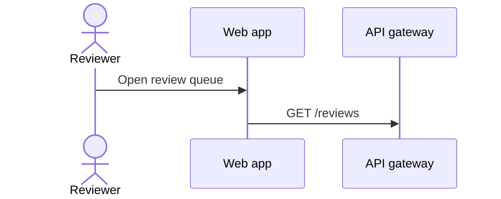
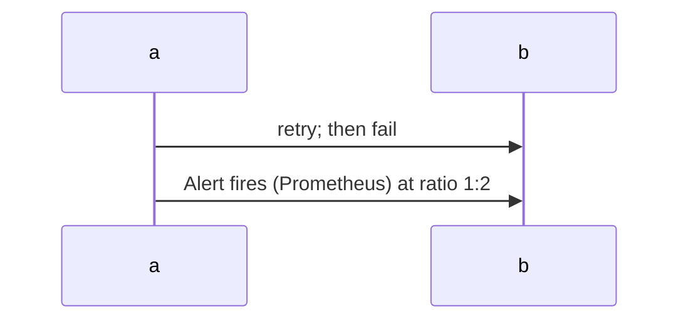
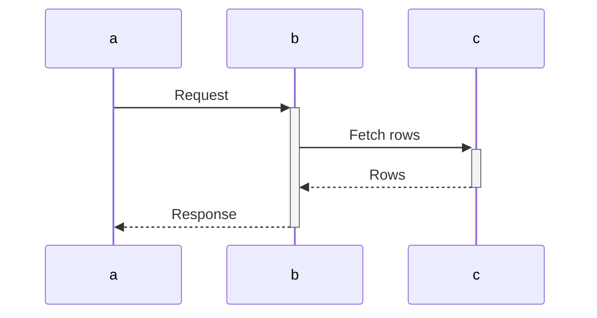
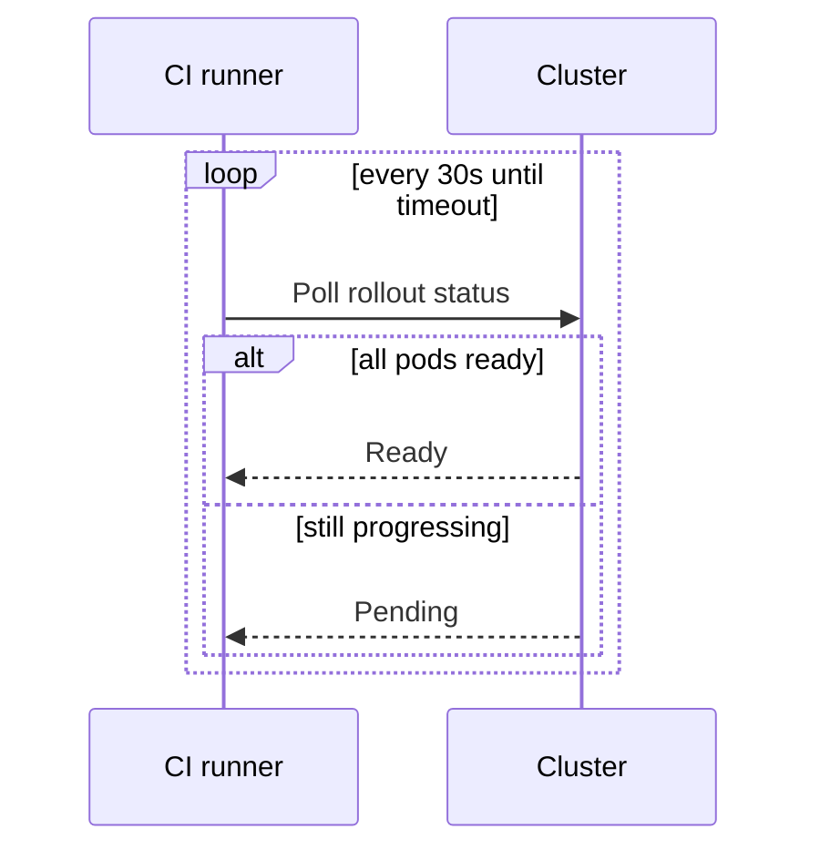
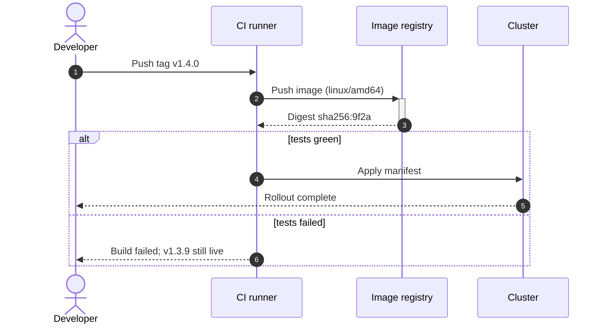

# Mermaid Sequence Diagrams

Use for ordered participant interactions. Choose flowcharts for process structure or state diagrams for one object's lifecycle. Apply `./mermaid-core.md`.

## Declaration and participants

- Open with `sequenceDiagram`.
- Declare all participants before messages, in the intended left-to-right order.
- Default to `actor` for humans and `participant` for services/stores because readers recognize the stick-figure/box distinction.
- Use short IDs and prose aliases: `participant api as API gateway`.



## Message text is free text, not a label

Do not quote message or note text; double quotes render literally. Text after the colon permits ordinary punctuation, including parentheses and additional colons. Escape semicolons as `#59;` because bare `;` terminates the statement.

Broken:

```
sequenceDiagram
    a->>b: retry; then fail
```

Correct:



- Apply the same escaping to `Note` text.
- `end` is safe in message text but fails as a sender/recipient ID.

## Arrows carry meaning

- Use `->>` for calls/requests and `-->>` for replies.
- Use `-)` for fire-and-forget and `-x` for lost/rejected messages.
- Avoid headless `->` and `-->` for messages.
- For portability, avoid bidirectional `<<->>`/`<<-->>` and `create`/`destroy` participants. Use two one-way messages instead of bidirectional arrows.

## Activation discipline

- Add activation bars only when busy duration matters.
- Prefer arrow `+`/`-` shorthand because it shows pairing in place.
- Pair every activation with a later deactivation on the same participant. Reread pairs: rendering catches inactive deactivation but allows unclosed activation.



## Blocks

- Give `alt`/`else`, `opt`, `loop`, `par`/`and`, and `break` a condition on the opening line; close each with `end`.
- Use `alt` for exclusive branches, `opt` for optional steps, `loop` for repetition, and `par` for concurrency.
- Prefer one nesting level, at most two. Split deeper interactions.



## Notes and numbering

- Use `Note over a,b:` for shared facts and `Note right of a:` for one participant. Put preconditions and side effects here.
- Add `autonumber` only when surrounding prose cites step numbers.

## Worked example


