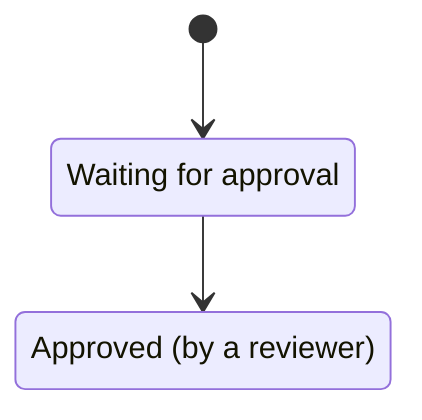
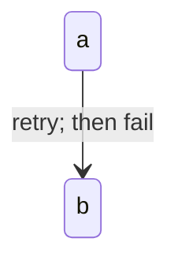
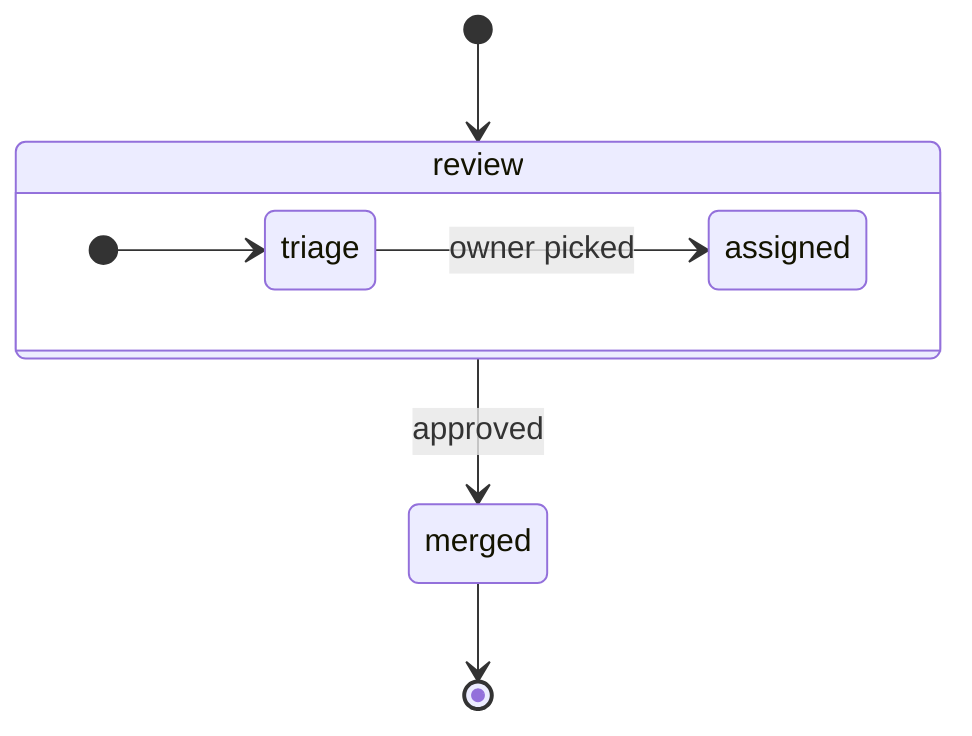
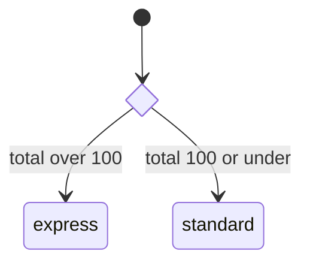
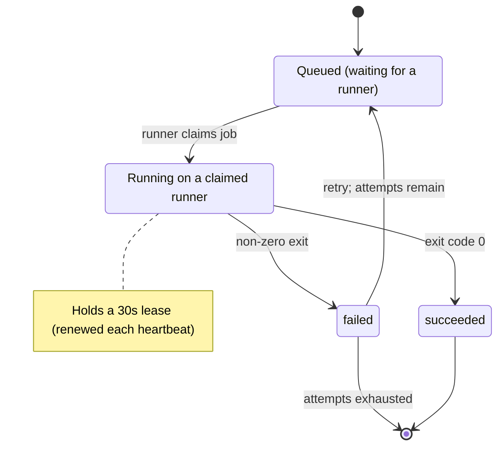

# Mermaid State Diagrams

Use for one thing's lifecycle and transition triggers. Choose sequences for participant messages or flowcharts for process steps. Apply `./mermaid-core.md`.

## Declaration and naming states

- Default to `stateDiagram-v2` for its newer renderer.
- Use single-token IDs; spaced names on transitions silently create one state per word. Attach prose with `id : Description` or `state "Description" as id`.
- IDs allow letters, digits, and `_`; hyphens fail.
- Avoid reserved `state` and `note` IDs. `end` and `direction` are usable for this diagram type.

Broken:

```
stateDiagram-v2
    [*] --> Waiting for approval
```

Correct:



## Start, end, and transitions

- `[*]` left of an arrow starts; right of an arrow ends. Use one start and the lifecycle's actual ends. This marker accepts no label or styling.
- Label transitions with triggering events/conditions, consistently labeling all or none.
- Transition labels and descriptions accept parentheses and colons bare. Escape semicolons as `#59;`; bare semicolons produce phantom states. Quoting does not prevent this and renders literally.

Broken:

```
stateDiagram-v2
    a --> b : retry; then fail
```

Correct:



## Composite states

- Nest with `state parent { ... }` and give each composite its own `[*] -->` start.
- Internal `direction LR` sets the group's axis independently.
- Keep nesting to one level; split deeper machines.
- Connect composites themselves across their boundary. Cross-composite inner-state transitions are upstream-unsupported even when a renderer accepts them.



## Choice, fork, join, and concurrency

- Use `<<choice>>` for an internal decision: one incoming transition and labeled outgoing branches. For external events, prefer labeled transitions from the state.
- Use `<<fork>>`/`<<join>>` only for paths that run concurrently and actually rejoin.
- Prefer composite `--` regions for concurrency that persists throughout a state.
- Put invariants and timing facts in `note right of id ... end note`, including leases, deadlines, and external effects.



## Worked example


