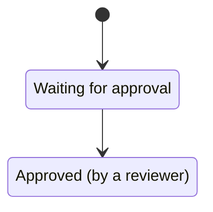
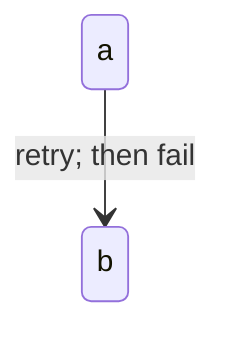
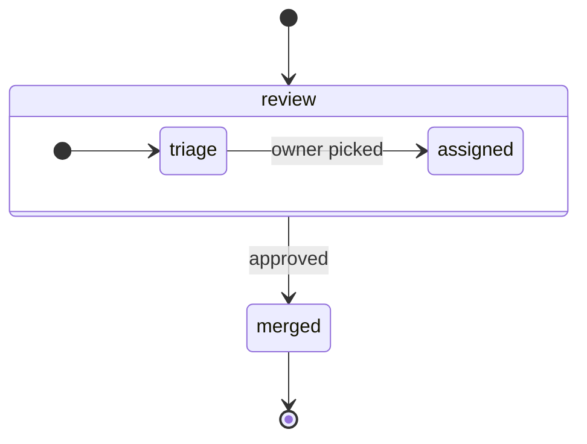
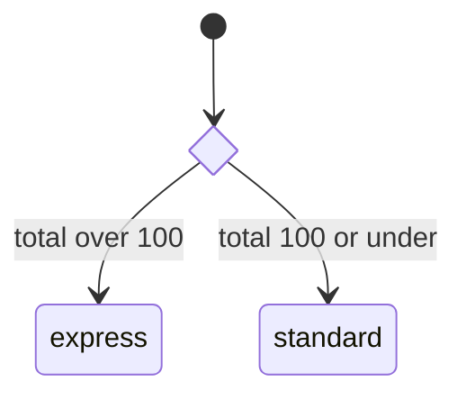
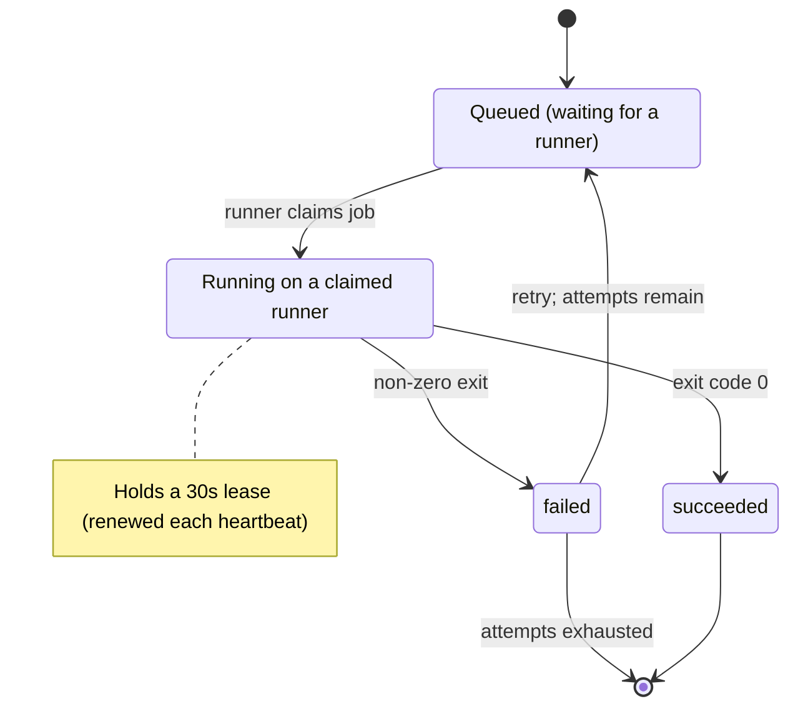

# Mermaid State Diagrams

State-specific conventions and traps, loaded by the `prepare-diagram` skill on top of
`./mermaid-core.md`. Quoting, ID discipline, direction, size, portability, and styling live in the
core sheet and are not repeated here. Snippets are render-verified against mermaid-cli **11.16.0**;
deliberately broken examples sit in plain fences.

Reach for a state diagram when the subject is one thing's lifecycle — the states it can occupy and
what moves it between them. When the subject is several participants exchanging messages, that is a
sequence diagram; when it is a process made of steps and decisions, a flowchart.

## Declaration and naming states

- Open with `stateDiagram-v2`. The bare `stateDiagram` keyword still parses but selects the older
  renderer — default to v2.
- A state name is a single token, and multi-word text on a transition line is split into one state per
  word with no warning: `[*] --> Waiting for approval` renders three states, `Waiting`, `for`, and
  `approval`. Give every state a one-token ID and attach the prose separately, either as
  `id : Description` or `state "Description" as id`.
- IDs take letters, digits, and `_`. A hyphen is a parse error, so `in_progress`, not `in-progress`.
- `state` and `note` are reserved and cannot be state IDs. `end` and `direction` are usable here —
  the flowchart sheet's lowercase-`end` trap does not carry over to this diagram type.

Broken — a multi-word name silently becomes three states:

```
stateDiagram-v2
    [*] --> Waiting for approval
```

Correct — either form:



## Start, end, and transitions

- `[*]` is the start when it sits left of an arrow and the end when it sits right. Give the diagram one
  start and as many ends as the lifecycle genuinely has. `[*]` is not a state: it takes no label and
  no styling.
- Label transitions with the event or condition that fires them — `running --> failed : timeout`. An
  unlabelled transition leaves the reader guessing at the trigger; label all of them or none.
- Transition labels and state descriptions take parentheses and a `:` bare. `;` splits the statement
  and turns the tail into phantom states: `a --> b : retry; then fail` renders states named `;`,
  `then`, and `fail`. Quoting does **not** help — the quotes render literally and the split still
  happens. Use the `#59;` entity from the core sheet.

Broken — three phantom states, and the label truncated to `retry`:

```
stateDiagram-v2
    a --> b : retry; then fail
```

Correct:



## Composite states

- `state parent { ... }` nests states. Give the composite its own `[*] -->` so the reader knows where
  it starts.
- `direction LR` inside the braces sets that group's internal axis, independent of the diagram's.
- Nest one level. Two levels render, but the layout tightens faster than the extra detail repays;
  prefer the core sheet's split-the-diagram move.
- A transition drawn between inner states of two *different* composites renders under 11.16.0, but
  upstream documents it as unsupported — connect the composites themselves instead, so the diagram
  survives a renderer that honors the restriction.



## Choice, fork, join, and concurrency

- `<<choice>>` marks a branch point: one transition in, labelled transitions out. Use it only when the
  branch is a decision taken *inside* the machine rather than an event arriving from outside —
  otherwise two labelled transitions leaving the state say it with less machinery.
- `<<fork>>` and `<<join>>` split into genuinely parallel paths and rejoin them. Both are worth their
  weight only when the paths run at once and the rejoin is real.
- `--` inside a composite state declares concurrent regions. Prefer it over fork/join when the
  parallelism is a standing property of one state rather than a one-off split.
- `note right of id ... end note` attaches prose. Notes hold invariants and timing facts that are not
  states — leases, deadlines, external effects.



## Worked example

One small machine applying the sheet — one-token IDs with prose descriptions, labelled transitions,
two real end states, an entity-escaped semicolon, and a note carrying a timing fact.


